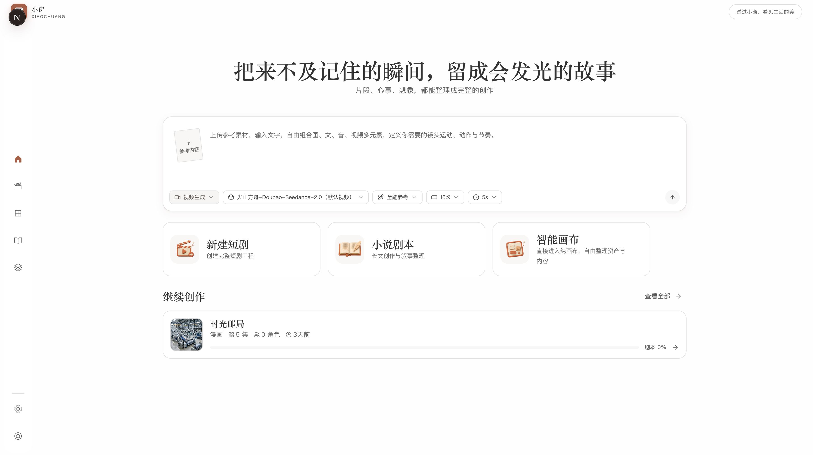
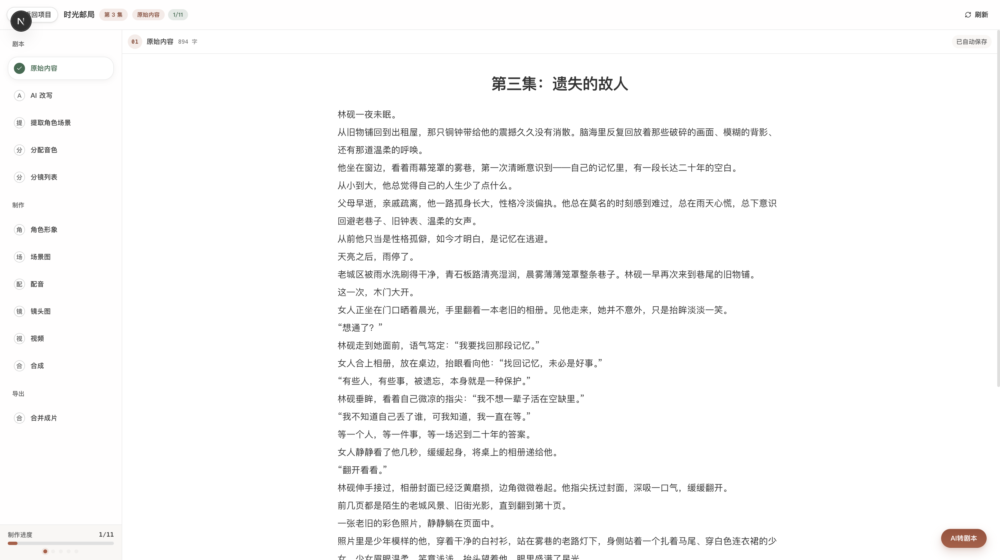
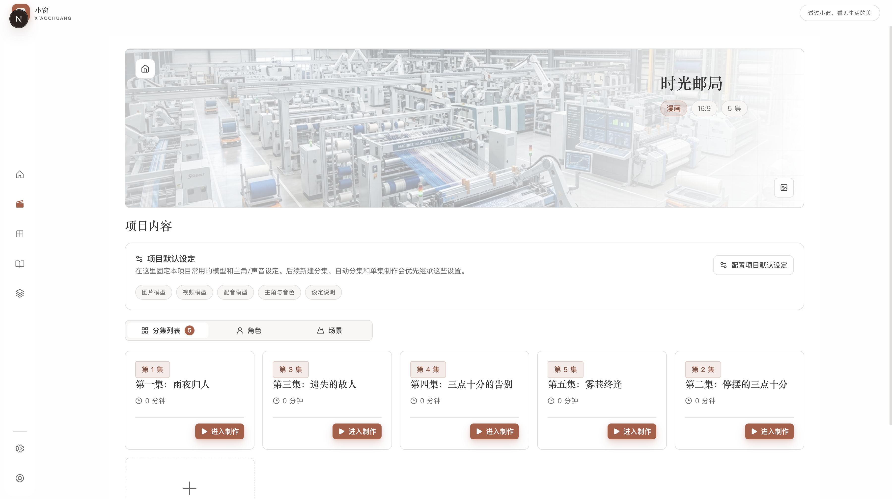
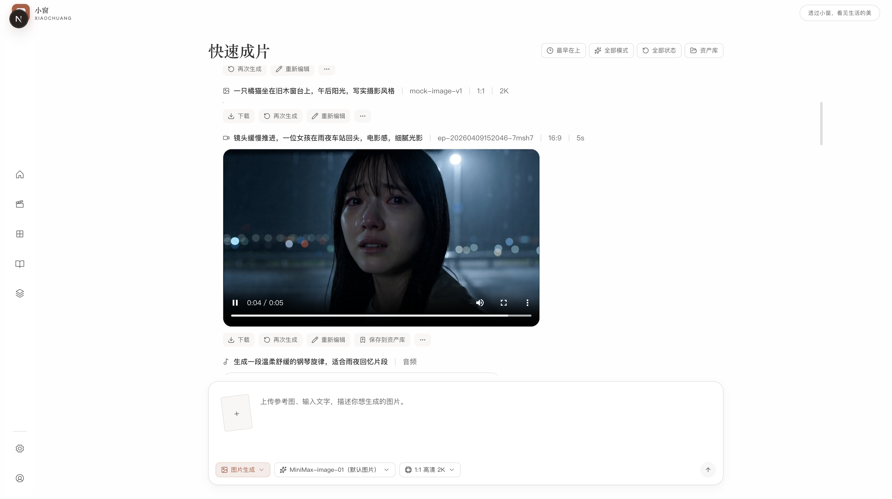

<div align="center">
  
  <h1>小窗 XIAOCHUANG</h1>
  <p>
    <strong>一个面向 AI 短剧与视频生产的全栈工作台。</strong><br />
    我们想认真回答一件事：能不能把「灵感 -> 剧本 -> 分镜 -> 素材 -> 成片」做成一条真正可工程化、可复用、可共建的生产链路。
  </p>
</div>

<p align="center">
  <a href="https://github.com/zhaozhaozhiyi/XIAOCHUANGv/stargazers">
    
  </a>
  <a href="https://github.com/zhaozhaozhiyi/XIAOCHUANGv/network/members">
    
  </a>
  <a href="https://github.com/zhaozhaozhiyi/XIAOCHUANGv/issues">
    
  </a>
</p>

## 这是什么

小窗不是一个“只会调几个模型接口”的演示项目，而是一个正在持续演进的 AI 内容生产系统。

如果你是产品经理，可以把它理解为一套围绕创作效率、流程标准化、团队协作与资产沉淀而设计的生产平台。

如果你是工程师，可以把它理解为一个全栈 TypeScript 的 AI 工作流样板：前台创作端、后台管理端、NestJS 业务中枢、共享契约层、异步任务队列、媒体处理与对象存储，全都在一个单仓里协同工作。

如果你是创业者、内容团队负责人或 AIGC 从业者，它更像一个可以直接参考、继续二开、也欢迎一起共建的底座。

## 为什么值得做

短剧和短视频的增长大家都看得到，但真正做过 production 的人都知道，最贵的从来不是“生成一张图”，而是下面这些问题：

- 从创意到成片链路太长，环节太碎
- 文案、剧本、分镜、素材、任务状态彼此割裂
- AI 能力很多，但缺少统一编排、统一状态、统一资产沉淀
- 团队一旦进入多人协作，流程就容易失控，复用也很难发生

小窗想解决的，不只是“做内容更快”，而是让内容生产这件事逐步具备下面这些产品价值：

- 更低的试错成本：把模糊创意快速推进到可讨论、可执行的生产状态
- 更强的流程确定性：把关键节点做成可追踪、可排队、可恢复的工程链路
- 更好的资产复用能力：让剧本、分镜、图片、音频、视频和任务记录沉淀下来
- 更现实的团队协作基础：为未来的角色分工、多人协同、运营管理留出结构空间

一句话概括就是：

> 小窗希望把 AI 视频生产，从“会一点魔法”推进到“像产品一样能跑、像系统一样能长”。

## 典型使用场景

- 想把一个创意主题快速推进成短剧/视频脚本
- 想把小说、故事、设定稿转换成更适合生产的结构化内容
- 想把分镜、素材、任务状态收口到一个统一工作台
- 想验证 AI 工作流产品的核心链路、架构边界和工程实现方式
- 想找一个可以开源共建、便于二次开发的内容生产底座

## 系统典型截图

下面这组截图展示的不是零散页面，而是一条从创意收敛到内容生产的核心链路。  
如果你关心的不是“某个功能能不能点”，而是“这个系统能不能承接真实流程”，这一段会更有参考价值。

| 首页总览：快速进入项目与创作链路 | 短剧项目：聚合任务、状态与内容资产 |
| --- | --- |
|  |  |

| 内容编辑：承接脚本与结构化创作过程 | 成片生成：把结果推进到预览与交付环节 |
| --- | --- |
|  |  |

这四张图连起来看，更接近小窗真正想做的事情：  
不是只给你一个“AI 按钮”，而是给你一个能持续推进创作任务的产品工作台。

## 从产品经理视角看，小窗的核心价值

### 1. 它不是单点工具，而是完整链路的生产系统

很多 AIGC 产品擅长解决某一个局部动作，比如写文案、出图片、做视频。但真正的业务价值，往往来自“链路被接起来”之后的效率提升。  
小窗更关注的是把上下游串起来，而不是只把某个点做到花哨。

### 2. 它适合做“工作台”，而不只是“玩具”

创作工作台最关键的不是炫，而是：

- 信息是否能沉淀
- 状态是否能追踪
- 任务是否能恢复
- 流程是否能扩展

这也是为什么仓库里会看到前台、后台、共享契约、队列、对象存储和媒体处理这些工程结构。它们共同服务的目标，是让系统能支撑真实生产，而不只是支撑一段 demo。

### 3. 它天然适合继续长大

从产品规划角度，小窗很适合作为这些方向的起点：

- 更强的 Agent 编排
- 更细的角色协作与权限体系
- 更丰富的模型接入与 provider 管理
- 更稳定的资产管理与可回溯生产记录
- 更完整的画布式工作流与可视化执行编排

所以它不只是“现在能做什么”，更重要的是“未来还能往哪里长”。

## 核心架构

当前仓库是一个全栈 TypeScript monorepo，核心运行单元包括：

- `apps/web`：用户创作端，Next.js App Router
- `apps/admin`：管理后台
- `apps/backend`：NestJS 业务中枢与任务编排引擎
- `packages/contracts`：前后端共享 API 契约
- `packages/canvas-shared`：画布节点、端口与执行语义共享层
- `packages/ui`：共享 UI 组件边界
- `tools`：验证、审计、运行时 gate 与辅助脚本

### 架构关键词

- 双前端形态：`web` 面向创作，`admin` 面向管理
- 后端中枢：NestJS 负责业务模块装配、任务调度、AI 调用与媒体编排
- 契约优先：前后端通过 `contracts` 共享接口结构，通过 `canvas-shared` 共享画布运行语义
- 异步执行：Redis + BullMQ 承载通用任务链和画布执行链
- 基础设施：PostgreSQL、对象存储、FFmpeg、Sharp 共同构成媒体生产底座

### 为什么这个架构有价值

- 对产品团队：方便继续长功能，而不是长一堆互相打架的页面
- 对工程团队：边界清晰，能逐步拆分、替换、扩展
- 对开源社区：阅读路径相对明确，适合围绕模块与链路共建

## 核心能力概览

- AI 文案处理：改写、提取、结构化拆分
- 剧本与短剧链路：围绕项目、剧集、分镜的端到端生产流程
- 画布式工作流：支持创作流程的可视化编排与执行承载
- 任务与队列系统：统一异步任务状态、执行与回填
- 素材与产物沉淀：统一管理静态资源、生成资源与媒体结果
- 管理后台能力：为运营、管理和后续业务治理预留空间

## 技术栈

- 前端：Next.js 16、React 19
- 后端：NestJS 11、Fastify
- 数据层：PostgreSQL、Drizzle ORM
- 队列：Redis、BullMQ
- 存储：S3 兼容对象存储，支持 MinIO 本地验证
- 媒体处理：FFmpeg、Sharp
- 语言与仓库组织：TypeScript Monorepo + npm workspaces

## 快速开始

环境要求：

- Node.js 22.x
- PostgreSQL 15+
- Redis
- FFmpeg 4.0+

安装与启动：

```bash
npm install
npm run db:init
npm run dev:web
```

默认访问：

- 用户端：`http://localhost:3001`
- 管理端：`http://localhost:3002`

常用命令：

```bash
npm run dev:web
npm run dev:admin
npm run dev:backend
npm run dev:all
npm run db:init
npm run generate:contracts
npm run queue:smoke
```

> 开发环境默认开启验证码模式，任意中国大陆手机号 + 验证码 `123456` 即可登录。  
> 如果你是第一次读这个仓库，推荐先从核心链路和截图建立整体印象，再开始本地启动。

## 适合谁来共建

我们尤其欢迎这些朋友：

- 全栈工程师：愿意一起把链路做稳、把边界做清楚
- AIGC 工程师：愿意一起接模型、调流程、做能力编排
- 产品经理：愿意一起把体验、流程和策略做深
- 设计师：愿意一起把创作工作台打磨得更专业
- 内容创作者：愿意用真实场景给系统提要求

能提 Issue、能提 PR、能给建议、能指出“这里不对劲”，都非常欢迎。  
开源不是大家来围观我表演，而是大家一起把事情做成。认真地说，真的很需要你。

## 联系我 / 进群交流

如果你想聊产品、聊技术、聊 AI 内容生产，或者想认真参与共建，欢迎来加我。

### 个人微信


- 添加备注：`小窗 + 来意`

### 微信交流群

微信群暂时没有单独开放二维码。  
如果你想进群交流，先加我微信，备注 `小窗 + 进群`，我来拉你。

## 如果这个项目对你有一点点启发

欢迎你做三件小事：

1. 点一个 [GitHub Star](https://github.com/zhaozhaozhiyi/XIAOCHUANGv) 支持一下
2. 提一个 Issue 告诉我你最想一起做的方向
3. 把它转给可能会感兴趣的朋友

`Star` 对开源项目真的很重要。  
它既是鼓励，也是信号，还是一种很朴素但很有效的“别停，继续做”。

所以如果你觉得这个方向值得，就拜托点一下。  
小窗先谢谢你，认真谢谢，也稍微调皮地谢谢。

## License

本项目基于 `MIT License` 开源。你可以自由使用、修改、分发和商用，但请保留原始版权声明与许可声明。
