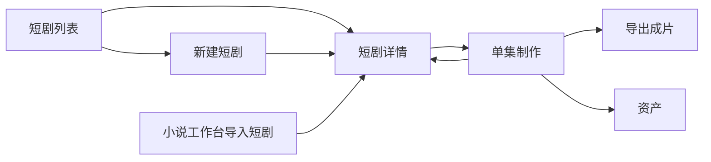

# 小窗 XIAOCHUANG - 短剧模块专项 PRD

**文档类型**: 模块 PRD
**状态**: draft
**修订号**: r12
**最后更新**: 2026-06-24

## 1. 文档目的

本文档用于明确短剧模块的页面布局、页面流转、单集工作台结构、按钮入口、状态反馈和验收标准。

本文档应直接支撑以下工作：

- 产品确认短剧模块的页面分工和生产主线
- 设计输出短剧列表、项目详情、单集工作台的交互稿
- 前端按页面区块、按钮、流程和状态开发
- 后端明确项目、分集、分镜、角色、场景、媒体结果的落点
- 测试按页面、步骤、生成、导出和入资产验收

## 1.1 需求状态标记

本文档从 r6 起增加需求状态标记，用于区分已经完成、需要复核、尚未对齐和新增规划项。

| 状态 | 含义 |
|------|------|
| `已完成` | 当前代码或真人测试记录已证明需求可用 |
| `部分完成` | 需求已有部分实现或部分链路可用，但仍有明确缺口 |
| `需复核` | 已有实现或修复记录，但仍需要回归、E2E 或真实数据复核 |
| `未对齐` | 当前实现、文档或入口口径仍有偏差 |
| `新增需求` | 本轮新增，尚未进入实现 |
| `规划中` | 当前版本不要求完成，但进入后续版本计划 |

## 2. 模块定位

短剧模块是项目化生产模块，用来围绕一个短剧项目持续推进内容制作，最终导出成片。

短剧模块解决的问题是：

- 用户做的不是一条内容，而是一个持续推进的短剧项目
- 用户需要按项目、按分集管理生产过程
- 用户需要把角色、场景、图片、视频、音频逐步沉淀下来
- 用户需要在一个明确的工作台里完成一集从文本到成片的生产

当前版本短剧模块不承担以下职责：

- 不承担全局任务中心
- 不承担快速成片转项目
- 不承担画布流转进短剧
- 不使用资产模块替代生产页面

## 3. 页面范围

当前版本短剧模块包含以下页面：

| 页面 | 页面目标 | 进入方式 | 页面结果 |
|------|----------|----------|----------|
| 短剧列表页 | 管理全部短剧项目 | 首页、侧边入口 | 查看项目、筛选项目、新建项目 |
| 新建短剧弹窗 | 创建新项目并初始化默认设定 | 首页短剧入口、短剧列表页 | 新项目建立并进入详情 |
| 短剧详情页 | 查看项目概况、管理分集、维护默认设定、查看角色和场景概览 | 短剧列表页、小说导入后 | 进入单集制作、自动分集、维护项目信息 |
| 单集制作页 | 完成本集从文本整理到导出成片的全部生产动作 | 短剧详情页进入 | 角色、场景、配音、镜头图、视频、合成、导出 |

## 4. 页面结构总览

### 4.1 短剧列表页

短剧列表页采用“标题区 + 操作区 + 筛选区 + 项目网格”的结构。

页面结构如下：

1. 页面标题区
2. 新建短剧按钮
3. 搜索与筛选区
4. 项目数量说明
5. 项目卡片网格

### 4.2 新建短剧弹窗

新建短剧采用弹窗式表单，而不是独立大页面。

弹窗结构如下：

1. 弹窗标题区
2. 基础信息区
3. 项目默认设定区
4. 主角与声音设定区
5. 底部确认按钮区

### 4.3 短剧详情页

短剧详情页采用“顶部项目头图区 + 项目默认设定区 + 内容 Tab 区”的结构。

页面结构如下：

1. 项目头图与基本信息区
2. 项目默认设定区
3. 内容 Tab 区
4. 分集 / 角色 / 场景内容区
5. 弹窗区：新增分集、自动分集、剧本上传

### 4.4 单集制作页

单集制作页采用“顶部栏 + 左侧步骤栏 + 中间工作区”的结构。

页面结构如下：

1. 顶部栏
2. 左侧流程步骤栏
3. 中间工作区
4. 中间工作区根据当前步骤切换不同面板

## 5. 页面流转

### 5.1 进入短剧模块

允许以下入口：

- 从首页进入短剧列表
- 从首页短剧入口直接打开新建短剧弹窗
- 从小说工作台导入短剧并生成新项目

不允许以下入口：

- 快速成片直接升级成短剧项目
- 画布直接进入短剧模块

### 5.2 页面主流转



### 5.3 页面流转规则

- 新建项目成功后必须进入新项目详情
- 自动分集完成后仍停留在项目详情页
- 从详情页点击某一集后进入单集制作页
- 单集制作页点击返回项目后，回到当前短剧详情页
- 单集制作完成导出后，结果可继续在当前页查看或下载

## 6. 短剧列表页规格

### 6.1 页面目标

短剧列表页负责管理和打开全部短剧项目。

### 6.2 页面布局

页面从上到下包含：

- 页面标题：`短剧项目`
- 新建短剧按钮
- 搜索框
- 风格筛选
- 排序下拉
- 项目数量说明
- 项目卡片网格

### 6.3 搜索与筛选

当前版本支持：

- 标题搜索
- 风格筛选
- 排序切换

排序项包含：

- 最近更新
- 最近创建
- 标题 A-Z

### 6.4 项目卡片规格

项目卡片必须展示：

- 项目封面
- 项目标题
- 项目风格标签
- 集数
- 角色数量
- 更新时间
- 打开项目按钮
- 删除按钮

### 6.5 项目卡片交互矩阵

| 交互对象 | 动作 |
|------|------|
| 点击封面 | 打开项目详情 |
| 点击标题 | 打开项目详情 |
| 点击“打开项目” | 打开项目详情 |
| 点击删除按钮 | 打开删除确认 |

### 6.6 页面状态

#### 加载态

- 展示项目卡骨架屏

#### 空状态

- 无项目时显示 `还没有短剧项目`
- 筛选后为空时显示 `没有符合筛选条件的项目`
- 空状态提供 `新建短剧` 按钮

#### 删除反馈

- 删除成功提示 `已删除`
- 删除失败弹出错误提示

## 7. 新建短剧弹窗规格

### 7.1 页面目标

新建短剧弹窗用于一次性创建项目并初始化该项目的长期默认设定。

### 7.2 表单结构

弹窗表单必须包含以下区块：

#### 基础信息区

- 项目标题
- 项目风格

#### 项目默认配置区

- 默认图片配置
- 默认视频配置
- 默认配音配置

#### 主角与声音设定区

- 主角名称
- 主角设定说明
- 主角默认音色
- 声音备注

### 7.3 按钮区

按钮区至少包含：

- 取消
- 创建项目

### 7.4 表单规则

- 项目标题必填
- 默认配置项可为空，空时表示跟随系统默认
- 主角与声音设定可为空，空时表示后续再补充

### 7.5 创建成功规则

- 创建完成后关闭弹窗
- 跳转到新项目详情页

### 7.6 创建失败规则

- 保留用户当前输入
- 弹出错误提示

## 8. 短剧详情页规格

### 8.1 页面目标

短剧详情页负责项目层管理，不直接承担生产动作。

### 8.2 顶部项目头图区

顶部区域必须展示：

- 返回入口
- 项目标题
- 项目风格
- 项目统计信息
- 封面图
- AI 生成封面入口
- 上传封面入口
- 新增分集按钮

### 8.3 封面管理规则

当前版本支持两种封面方式：

- AI 生成封面
- 本地上传封面

要求如下：

- AI 生成中需要显示处理中
- AI 生成成功后更新项目封面
- 上传成功后立即更新项目封面

### 8.4 项目默认设定区

详情页必须提供项目默认设定区。

该区域负责维护：

- 默认图片配置
- 默认视频配置
- 默认配音配置
- 主角名称
- 主角默认音色
- 主角设定说明
- 声音备注

规则要求：

- 该区域是项目级长期设定
- 后续新增分集、自动分集、单集制作默认继承这些设置
- 保存后提示 `项目默认设定已保存`

### 8.5 内容 Tab 区

当前版本详情页包含 3 个主要 Tab：

- 分集列表
- 角色概览
- 场景概览

#### 分集列表 Tab

负责展示：

- 分集编号
- 分集标题
- 分集时长
- 分集内容预览
- 进入制作入口

#### 角色概览 Tab

负责展示：

- 项目角色列表
- 角色头像
- 角色名称
- 角色描述

#### 场景概览 Tab

负责展示：

- 场景图
- 场景名称
- 场景说明

### 8.6 新增分集入口

新增分集入口至少支持：

- 手动新增单集
- 上传剧本并自动分集

### 8.7 自动分集弹窗

自动分集弹窗必须包含：

- 剧本输入区或上传说明
- 是否替换已有内容的逻辑说明
- 确认开始分集按钮

规则要求：

- 自动分集完成后提示新建集数
- 新建的分集默认继承项目默认设定

## 9. 单集制作页规格

### 9.1 页面目标

单集制作页是短剧模块唯一生产页面。

所有剧本整理、分镜拆解、角色形象、场景图片、配音、镜头图、视频、合成、导出，都在这里完成。

### 9.2 顶部栏结构

顶部栏必须展示：

- 返回项目按钮
- 项目标题
- 第几集标识
- 当前阶段标识
- 当前进度
- 角色数量与镜头数量
- 刷新按钮
- 继续制作 / 查看成片按钮

### 9.3 左侧步骤栏结构

左侧步骤栏用于控制整集制作流。

当前版本步骤固定为：

#### 剧本阶段

- 原始内容
- AI 改写
- 提取角色场景
- 分配音色
- 分镜列表

#### 制作阶段

- 角色形象
- 场景图片
- 配音生成
- 镜头图片
- 视频生成
- 视频合成

#### 导出阶段

- 合并成片

### 9.4 中间工作区结构

中间工作区根据当前步骤切换内容面板：

- 剧本阶段显示 `ScriptPanel`
- 制作阶段显示 `ProductionPanel`
- 导出阶段显示 `ExportPanel`

## 10. 剧本阶段规格

### 10.1 原始内容步骤

页面必须包含：

- 步骤标题
- 文本字数
- 自动保存状态
- 大文本编辑区
- 底部步骤跳转气泡

主要交互：

- 用户编辑原始文本
- 停止输入后自动保存本集原始内容
- 自动保存过程中显示保存中、已保存或保存失败状态
- 完成后可进入 AI 改写

### 10.2 AI 改写步骤

页面必须包含：

- 右下角悬浮主 CTA：`AI转剧本` / `重新改写`
- 跳过改写辅助入口
- 改写结果文本区
- 流式状态与字数反馈

主要交互：

- 用户点击右下角悬浮主 CTA 发起改写
- 改写中显示流式状态、字数变化和可见进度
- 改写结果回写到文本区
- 用户可手动继续修改

### 10.3 提取角色与场景步骤

页面必须包含：

- 提取结果摘要区
- 角色列表区
- 场景列表区
- 右下角悬浮主 CTA：`提取角色场景` / `重新提取`

主要交互：

- AI 从剧本中提取角色和场景
- 提取后显示角色和场景结果
- 用户确认内容是否可用于后续制作

### 10.4 分配音色步骤

页面必须包含：

- 音色分配结果统计
- 音色库列表
- 每个角色的音色选择卡
- 生成试听文件辅助按钮
- 右下角悬浮主 CTA：`分配音色` / `进入分镜列表`

每个角色卡至少展示：

- 角色名称
- 当前音色
- 角色描述
- 音色选择下拉
- 试听按钮
- 音频播放器

### 10.5 分镜列表步骤

页面必须包含：

- 分镜列表
- 当前镜头详情区
- 新增镜头辅助入口
- 分镜调整辅助入口
- 右下角悬浮主 CTA：`AI拆解分镜` / `进入制作`

每个分镜至少展示：

- 镜头编号
- 标题
- 描述
- 时长
- 景别
- 运镜
- 对白情况

交互规则：

- 空态不重复放置主操作按钮
- Toolbar 只保留新增、调整等辅助动作
- 主动作统一交给右下角悬浮 CTA

## 11. 制作阶段规格

### 11.1 制作工作台结构

制作阶段顶部必须有制作子 Tab。

当前版本子 Tab 固定为：

- 角色形象
- 场景图片
- 配音生成
- 镜头图片
- 视频生成
- 视频合成

每个子 Tab 标题后需展示当前完成数 / 总数。

### 11.2 角色形象 Tab

页面必须展示：

- 需生成角色数量
- 当前图片配置
- 批量生成按钮
- 角色形象卡片网格

每张角色卡必须展示：

- 角色头像或占位图
- 角色名
- 角色类型
- 当前状态：待生成 / 生成中 / 已生成
- 单个生成按钮

### 11.3 场景图片 Tab

页面必须展示：

- 场景数量
- 当前图片配置
- 批量生成按钮
- 场景卡片网格

每张场景卡必须展示：

- 场景图或占位图
- 场景名
- 时间信息
- 当前状态
- 生成场景图按钮

### 11.4 配音生成 Tab

页面必须展示：

- 可配音对白数量
- 当前配音配置
- 批量配音按钮
- 分镜对白卡片列表

每张对白卡必须展示：

- 镜头编号
- 说话人
- 对白内容
- 状态
- 生成配音按钮或音频播放器

### 11.5 镜头图片 Tab

页面必须展示：

- 已完成镜头帧数量
- 当前图片配置
- 每个分镜的首帧与尾帧生成区

每个镜头卡必须展示：

- 镜头编号
- 首帧区
- 尾帧区
- 镜头描述
- 宫格工具按钮
- 首帧 / 尾帧状态标签

### 11.6 视频生成 Tab

页面必须展示：

- 已完成镜头视频数量
- 当前视频配置
- 批量生成按钮
- 镜头视频卡片网格

每张视频卡必须展示：

- 镜头编号
- 视频播放器或占位图
- 当前状态
- 生成 / 重新生成按钮

### 11.7 视频合成 Tab

页面必须展示：

- 已合成数量
- 批量合成按钮
- 合成卡片网格

每张合成卡必须展示：

- 镜头编号
- 状态
- 镜头描述
- 已合成视频预览或空状态
- 合成 / 重新合成按钮

## 12. 导出阶段规格

### 12.1 导出页结构

导出页必须展示：

- 当前已合成镜头数 / 总镜头数
- 成片预览区
- 右下角悬浮主 CTA：`开始合并` / `前往视频合成`
- 下载成片按钮
- 重新合并按钮

### 12.2 导出规则

- 所有镜头都合成完成后，才允许开始合并
- 未满足合并条件时不显示 disabled 主按钮，改为展示原因和下一步
- 合并成功后显示成片播放器
- 合并成功后允许下载成片

## 13. 配置继承规则

当前版本所有图片、视频、配音动作必须遵守以下配置优先级：

1. 本集覆盖配置
2. 项目默认配置
3. 全局默认配置

主角相关规则：

- 主角名称和主角默认音色作为角色提取与配音优先参考
- 声音备注作为配音阶段补充约束

## 14. 资产沉淀规则

短剧模块产生的以下结果必须进入资产：

- 角色
- 场景
- 图片
- 视频
- 音频

当前版本不要求在短剧页内直接查看资产库全量内容，但必须保证结果可沉淀。

## 15. 页面状态

### 15.1 加载态

- 列表页显示项目骨架屏
- 详情页显示项目详情骨架屏
- 单集制作页显示居中加载态

### 15.2 空状态

- 列表页无项目时显示空状态
- 制作页无分镜时显示“请先完成分镜拆解”
- 某个制作 Tab 无可生产内容时显示对应空状态说明

### 15.3 处理中状态

- 改写、提取、分配音色、生成图片、生成视频、合成等动作必须显示进行中状态
- 批量动作需有批量处理中提示

### 15.4 成功与失败反馈

- 成功动作必须有 toast 提示
- 失败动作必须保留当前上下文，并在当前页面显示可读错误原因
- 可重新生成的动作要允许重试
- provider 原始错误不得直接暴露给普通用户

## 16. 页面线框说明

### 16.1 列表页线框

```text
+--------------------------------------------------------------------------------+
| 短剧项目                                                     [新建短剧]        |
+--------------------------------------------------------------------------------+
| [搜索框...............................] [风格筛选] [排序]                      |
| 共 N 个项目                                                                    |
+--------------------------------------------------------------------------------+
| 项目卡网格                                                                      |
| [封面][标题][风格][集数][角色数][更新时间][打开项目]                            |
+--------------------------------------------------------------------------------+
```

### 16.2 详情页线框

```text
+--------------------------------------------------------------------------------+
| 返回 | 项目封面 | 项目标题 | 风格 | 统计 | [AI生成封面] [上传封面] [新增分集]     |
+--------------------------------------------------------------------------------+
| 项目默认设定                                                                    |
| 图片配置 | 视频配置 | 配音配置 | 主角 | 音色 | 声音备注 | [保存]                  |
+--------------------------------------------------------------------------------+
| [分集列表] [角色概览] [场景概览]                                                |
| Tab 内容区                                                                      |
+--------------------------------------------------------------------------------+
```

### 16.3 单集制作页线框

```text
+--------------------------------------------------------------------------------+
| 返回项目 | 项目标题 | 第X集 | 当前阶段 | 进度 | 角色数/镜头数 | [刷新] [继续制作]   |
+--------------------------------------------------------------------------------+
| 左侧步骤栏         |                 中间工作区                                  |
| 原始内容           |  ScriptPanel / ProductionPanel / ExportPanel                |
| AI 改写            |                                                              |
| 提取角色场景       |                                                              |
| 分配音色           |                                                              |
| 分镜列表           |                                                              |
| 角色形象           |                                                              |
| 场景图片           |                                                              |
| 配音生成           |                                                              |
| 镜头图片           |                                                              |
| 视频生成           |                                                              |
| 视频合成           |                                                              |
| 合并成片           |                                                              |
+--------------------------------------------------------------------------------+
```

## 17. 页面清单需求

### 17.1 列表页必须具备

- 新建短剧入口
- 搜索
- 风格筛选
- 排序
- 项目卡片
- 删除确认

### 17.2 详情页必须具备

- 项目封面管理
- 项目默认设定
- 分集列表
- 角色概览
- 场景概览
- 新增分集
- 自动分集

### 17.3 单集制作页必须具备

- 顶部栏
- 左侧步骤栏
- 剧本阶段面板
- 制作阶段子 Tab
- 导出面板

## 18. 验收清单

### 18.1 布局验收

- 列表页、详情页、单集制作页职责是否清晰
- 单集制作页是否保持“左步骤 + 中间工作区”结构

### 18.2 流转验收

- 新建项目后是否进入详情页
- 自动分集后是否正确生成分集
- 从详情页进入单集制作是否正确
- 导入短剧后是否正确进入新项目

### 18.3 生产验收

- 原始内容、AI 改写、角色场景提取、音色分配、分镜拆解是否可完成
- 角色图、场景图、配音、镜头图、视频、合成是否都能逐步推进
- 导出阶段是否能生成并下载成片

### 18.4 状态验收

- 加载态、空状态、处理中状态是否明确
- 成功与失败提示是否明确
- 批量生成和批量合成是否有状态反馈

### 18.5 边界验收

- 详情页是否没有承担生成动作
- 单集制作页是否承担全部生产动作
- 是否没有引入画布流转和快速成片升级项目能力

## 19. 当前版本边界

当前版本短剧模块只做以下闭环：

- 管理项目
- 管理分集
- 维护项目默认设定
- 进入单集工作台
- 完成一集从文本到成片的生产
- 导出成片
- 沉淀资产

当前版本不扩展以下内容：

- 快速成片升级短剧项目
- 画布进入短剧
- 在详情页直接做生成
- 用资产模块替代短剧生产页面

## 20. 当前对齐状态总表

本节按 2026-06-24 的需求梳理结果，对短剧模块当前状态做归并标记。

| 编号 | 需求项 | 状态 | 说明 |
|------|--------|------|------|
| DRAMA-S-01 | 短剧列表、详情、单集制作三类主页面 | `已完成` | 实施审计已确认页面和主入口存在 |
| DRAMA-S-02 | 新建短剧并进入详情页 | `已完成` | 真人复测已重新走通 |
| DRAMA-S-03 | 手动新增分集并进入单集制作页 | `已完成` | 曾出现 500，后续已修复并完成深测 |
| DRAMA-S-04 | 上传剧本并自动分集 | `已完成` | 当前已有入口、替换说明和成功反馈 |
| DRAMA-S-05 | 单集主链路：原始内容到合并成片 | `已完成` | 已用真实模型、数据库和媒体产物跑通 |
| DRAMA-S-06 | 角色形象、场景图、配音、镜头图、视频、合成六个制作子流程 | `已完成` | 第五轮复核已有页面、数据库、产物三重证据 |
| DRAMA-S-07 | 单集工作台主 CTA 统一规则 | `已完成` | 本轮已完成代码静态复核和 Playwright 回归，主 CTA、导出页条件 CTA、自动保存、Agent 链路均通过 |
| DRAMA-S-08 | 原始内容自动保存和保存状态 | `已完成` | 工作台问题清单记录已改为自动保存 |
| DRAMA-S-09 | AI 改写流式状态和字数反馈 | `已完成` | 工作台问题清单记录已接入流式状态显示 |
| DRAMA-S-10 | 生产区滚动策略统一 | `已完成` | 本轮代码复核确认生产区保留单一 `panel-scroll` 主滚动层，分镜列表、音色库和生产内容不再形成二级纵向滚动 |
| DRAMA-S-11 | 长任务状态持久化和刷新恢复 | `已完成` | 视频、合成、合并已有轮询与刷新恢复证据；本轮真实测试确认短剧 AI/SSE 类任务可写入 `ai_runs -> tasks`，运行中可查询，工作台刷新可恢复并轮询到终态，失败态有可读错误 |
| DRAMA-S-12 | 短剧产物进入资产并可追踪来源 | `已完成` | 本轮代码复核确认媒体资产写入 `assets` 并带来源字段，角色/场景通过短剧详情聚合进入资产页；0.22.0 仍补完整验收记录 |
| DRAMA-S-13 | `/create` 聚合入口口径 | `已完成` | 本文已同步为首页承接；短剧不再依赖独立 `/create` 聚合页 |
| DRAMA-S-14 | ownership / soft delete / 删除审计 | `新增需求` | TRD 审计显示全局仍未完全收敛，短剧域需优先审计 |
| DRAMA-S-15 | 统一响应 envelope 和错误结构 | `新增需求` | 短剧长链路依赖统一错误提示，需要和 TRD 收口联动 |
| DRAMA-S-16 | 单集工作台视觉与响应式复核 | `已完成` | 0.21.1 真实视口探针已覆盖桌面 1440x900 与移动 390x844；顶部栏、步骤栏、悬浮 CTA 可见，无横向溢出 |

## 21. 对齐与复核记录

### 21.0 本轮复核记录

复核日期：2026-06-24

已执行：

- 静态复核：`ScriptPanel`、`ProductionPanel`、`ExportPanel`、`use-workbench`、资产页、后端 `AssetsService`
- ESLint：`npm --workspace apps/web exec eslint src/components/episode/script/script-panel.tsx src/components/episode/production/production-panel.tsx src/components/episode/export/export-panel.tsx src/hooks/use-workbench.ts 'src/app/(default)/(protected)/assets/page.tsx' e2e/prd-workbench.spec.ts`
- Playwright：`npm --workspace apps/web exec playwright test e2e/prd-workbench.spec.ts --project=chromium --workers=1`
- 真实视口探针：临时 E2E 服务 + Playwright 脚本访问真实单集工作台，覆盖桌面 `1440x900` 与移动 `390x844`

复核结果：

- ESLint 0 error，剩余 4 个 `` 性能 warning，不影响本轮需求判断
- Playwright 工作台回归 9 passed
- 主 CTA 统一、导出页条件 CTA、自动保存、Agent 按钮链路可关闭为已完成
- 长任务状态统一已完成代码收口与真实测试，`DRAMA-N-01` 可关闭为已完成
- 桌面与移动视口复核通过：`document.scrollWidth - clientWidth = 0`，顶部栏、步骤栏、右下角悬浮 CTA 均可见，CTA 位于视口内且不遮挡顶部栏；`DRAMA-N-08` 可关闭为已完成

### 21.1 创建入口口径已对齐

状态：`已完成`

当前代码中 `/create` 聚合入口已下线并重定向回首页，短剧模块不应再把独立创建入口作为稳定页面依赖。本次 r7 已将短剧模块入口口径统一为首页和短剧列表页承接。

调整要求：

- `进入短剧模块` 入口改为：首页短剧入口、短剧列表页新建、小说工作台导入短剧
- 保留 `/create/video` 作为快速成片入口，不作为短剧创建入口
- 新建短剧弹窗仍由短剧列表页和首页短剧入口触发
- 测试用例不得依赖 `/create` 聚合页

验收标准：

- 用户能从首页或短剧列表新建短剧
- 访问 `/create` 不再被短剧模块测试视为必要路径
- PRD、E2E、导航文案三处口径一致

### 21.2 工作台 CTA 规则已复核

状态：`已完成`

当前问题清单显示侧边栏语义、分镜主动作、配音主动作、锁定态 CTA、导出页 disabled 主按钮、生产区主动作层级等问题已处理。本轮已通过代码静态复核与 Playwright 工作台回归确认当前规则可用。

调整要求：

- 每个步骤最多只有一个全局主 CTA
- 全局主 CTA 优先固定在右下角悬浮位置
- Toolbar 只放辅助动作、批量动作和状态信息
- 空态不重复放置主操作按钮
- 不满足条件时不提前显示 disabled 主按钮，而是显示原因和下一步

验收标准：

- 原始内容、AI 改写、提取角色场景、分配音色、分镜列表、制作区、导出区全部符合统一 CTA 规则
- E2E 覆盖自动保存和悬浮 CTA，不再查找旧按钮

### 21.3 长任务状态需要统一

状态：`已完成`

短剧模块已经修复视频状态刷新后误锁的问题。视频、合成、合并链路已有轮询、状态查询、失败提示和刷新恢复证据。本轮已为 AI 改写、提取角色场景、分配音色、分镜拆解补充统一任务状态落账：流式任务开始时写入 `ai_runs` 和 `tasks`，成功时标记 completed，失败时标记 failed，工作台刷新时按 `drama_ai_skill + episode_id` 读取 queued/running 状态，恢复运行提示，并继续轮询到 completed/failed 终态。

真实测试已覆盖：后端运行中任务查询、SSE 完成后 completed、前端工作台刷新恢复运行提示并轮询到终态、失败任务写入 failed 和可读错误。

覆盖范围：

- AI 改写
- 提取角色场景
- 分配音色
- 分镜拆解
- 角色形象生成
- 场景图片生成
- 配音生成
- 镜头图片生成
- 视频生成
- 视频合成
- 合并成片

调整要求：

- 所有长任务至少包含：未开始、排队中、处理中、已完成、失败、可重试
- 页面刷新后不得丢失真实运行状态
- 已有可播放或可用产物时，不得因旧失败状态锁死重新生成入口
- 批量任务失败时允许逐项重试

验收标准：

- 每类长任务刷新页面后状态仍正确
- 失败态显示可读原因和下一步
- 可重试动作不会重复创建不可控任务

### 21.4 原部分完成项与验收记录

截至 2026-06-24，本轮已对原 `部分完成` 项完成代码收口和真实链路复核。

| 原部分完成项 | 本轮代码收口 | 真实测试记录 | 版本 |
|--------------|--------------|----------------|------|
| DRAMA-S-11 / DRAMA-N-01：长任务状态持久化和刷新恢复 | 1. AI/SSE 类任务写入 `ai_runs`；2. 同步生成 `tasks` 记录；3. 成功/失败写回 completed/failed；4. `tasks` 列表支持 `episode_id` 过滤；5. 工作台刷新后读取 queued/running AI 任务并恢复运行提示；6. 恢复后继续轮询 task 到 completed/failed 终态 | 1. `prd-workbench.spec.ts` 9 passed；2. 真实后端 `script_rewriter` 运行中查到 `running` task，SSE done 后 task 为 `completed`；3. 真实前端工作台在运行中任务存在时显示 `AI 改写剧本 · 处理中`，终态后清除运行提示；4. 真实失败探针触发 `voice_assigner` 无角色错误，task 为 `failed`，错误文案可读 | `0.21.1` |

完成判定：

- AI 改写、提取角色场景、分配音色、分镜拆解刷新后不会出现不可解释的处理中或空状态
- 视频、合成、合并继续保持当前已验证的刷新恢复能力
- 所有失败态都有可读原因、可重试动作和不会破坏已有产物的保护规则
- 验收记录写回本 PRD 或对应版本计划

## 22. 新增需求池

### 22.1 DRAMA-N-01：短剧运行状态与失败恢复收口

状态：`已完成`
建议版本：`0.21.1`

需求说明：

- 建立短剧长任务统一状态字典
- 梳理任务状态与业务对象状态的映射
- 针对 provider 超时、下载失败、webhook 失败、内容安全失败提供可读提示
- 失败后保留上下文，允许重试或跳过

验收标准：

- 视频生成失败后可重试
- 合成失败后可重试
- 页面刷新后不出现“已有结果但按钮被锁死”
- 错误提示不直接暴露 provider 原始报错

### 22.2 DRAMA-N-02：项目默认配置来源可见化

状态：`新增需求`
建议版本：`0.21.2`

需求说明：

- 图片、视频、配音配置区显示当前配置来源
- 来源包含：本集覆盖、项目默认、全局默认
- 当用户修改本集配置时，明确提示只影响当前集

验收标准：

- 用户在制作页能看出当前使用哪个层级的配置
- 本集覆盖配置不会误改项目默认配置
- 项目默认配置修改后，新分集能继承

### 22.3 DRAMA-N-03：分镜编辑能力补强

状态：`新增需求`
建议版本：`0.21.2`

需求说明：

- 支持新增镜头
- 支持删除镜头
- 支持调整镜头顺序
- 支持复制镜头
- 支持修改镜头时长、景别、运镜、对白
- 支持按单镜头重新生成图片或视频

验收标准：

- 分镜顺序调整后保存并刷新不丢失
- 删除镜头前有确认
- 已生成素材的镜头被修改时，页面提示可能影响后续视频和合成

### 22.4 DRAMA-N-04：生成前确认预览

状态：`新增需求`
建议版本：`0.21.2`

需求说明：

- 角色图、场景图、镜头图、视频生成前展示本次生成摘要
- 摘要包含 prompt、参考图、模型配置、画幅、时长等关键信息
- 用户可以确认生成或返回修改

验收标准：

- 视频生成前能看到模型、参考模式和时长
- 镜头图生成前能看到首帧和尾帧 prompt 摘要
- 批量生成前能看到本次影响的项目数量

### 22.5 DRAMA-N-05：短剧产物资产追踪验收

状态：`新增需求`
建议版本：`0.22.0`

需求说明：

- 补齐短剧产物进入资产库的端到端验收记录
- 角色、场景、图片、视频、音频、成片都需要可追踪来源
- 来源应能回到短剧、分集或具体制作上下文

验收标准：

- 资产库能看到短剧生成的角色和场景
- 媒体资产能预览或下载
- `打开来源` 能回到对应短剧上下文

### 22.6 DRAMA-N-06：短剧域 ownership / soft delete 审计

状态：`新增需求`
建议版本：`0.22.0`

需求说明：

- 审计短剧项目、分集、角色、场景、分镜、生成记录、资产来源的 ownership
- 删除项目和分集优先软删除
- 删除不应破坏资产来源追溯

验收标准：

- 用户不能访问或修改不属于自己的短剧数据
- 删除短剧后列表不可见，但必要审计和来源关系不被硬破坏
- 批量删除或脚本删除不绕过 ownership 校验

### 22.7 DRAMA-N-07：短剧全链路验收脚本

状态：`新增需求`
建议版本：`0.22.0`

需求说明：

建立一条稳定验收路径：

1. 新建短剧
2. 新增分集
3. 编辑原始内容并等待自动保存
4. AI 改写
5. 提取角色场景
6. 分配音色
7. 分镜拆解
8. 生成角色图
9. 生成场景图
10. 生成配音
11. 生成镜头图
12. 生成视频
13. 视频合成
14. 合并成片
15. 在资产库验证产物

验收标准：

- 该链路可以在固定测试账号下重复执行
- 每一步有可见状态和失败提示
- 最终成片可播放、可下载、可追踪来源

### 22.8 DRAMA-N-08：单集工作台视觉与响应式复核

状态：`已完成`
建议版本：`0.21.1`

需求说明：

- 对单集工作台的顶部栏、左侧步骤栏、中间文档区、生产区和导出区做桌面端视觉复核
- 对移动端和窄屏下的步骤栏、生产 Tab、悬浮 CTA、播放器区域做布局复核
- 重点检查文字是否溢出、按钮是否重叠、滚动层是否过多、主 CTA 是否被遮挡

验收标准：

- 桌面端和移动端都不存在明显重叠或文字溢出
- 悬浮主 CTA 在所有步骤均可见、可点击且不遮挡关键内容
- 生产区必要的横向滚动可用，不出现多层纵向滚动互相嵌套

完成记录：

- 2026-06-24 真实视口探针通过桌面 `1440x900` 与移动 `390x844`
- 两个视口均无页面级横向溢出，顶部栏、步骤栏和悬浮 CTA 均可见
- 悬浮 CTA 均在视口内，未与顶部栏重叠

### 22.9 DRAMA-N-09：统一响应 envelope 与错误结构

状态：`新增需求`
建议版本：`0.22.0`

需求说明：

- 短剧相关 API 返回统一响应 envelope
- 失败响应包含稳定错误码、用户可读提示、可选排查信息和 request id
- 前端不直接展示 provider 原始错误
- 生成类接口的错误结构能被长任务状态模型消费

验收标准：

- 短剧创建、分集、AI 处理、图片、音频、视频、合成、合并接口错误结构一致
- 前端 toast、页面错误区、任务失败态展示相同语义
- 日志中仍能保留开发排查需要的 provider 原始信息

## 23. 版本排期建议

| 版本 | 短剧模块重点 |
|------|--------------|
| `0.21.1` | 创建入口口径同步、工作台 CTA 复核、长任务状态和失败恢复收口、视觉与响应式复核 |
| `0.21.2` | 默认配置来源可见化、分镜编辑补强、生成前确认预览 |
| `0.22.0` | 短剧全链路验收、资产追踪验收、ownership / soft delete 审计、统一响应 envelope 与错误结构 |

## 24. 更新日志

| 日期 | 修订号 | 更新内容 |
|------|--------|----------|
| 2026-06-24 | r12 | 完成真实视口复核并关闭 DRAMA-S-16 / DRAMA-N-08：桌面 1440x900 与移动 390x844 均无横向溢出；顶部栏、步骤栏、悬浮 CTA 可见；CTA 在视口内且不遮挡顶部栏 |
| 2026-06-24 | r11 | 完成真实测试并关闭 DRAMA-S-11 / DRAMA-N-01：工作台 E2E 9 passed；真实后端 AI/SSE 任务验证 running -> completed；真实前端验证刷新恢复运行提示并轮询到终态；真实失败探针验证 failed 和可读错误 |
| 2026-06-24 | r10 | 完成短剧 AI/SSE 类任务状态代码收口：AI 改写、提取角色场景、分配音色、分镜拆解写入 `ai_runs` 与 `tasks`；任务列表支持 `episode_id` 过滤；工作台刷新后恢复当前集 AI 运行提示并轮询到终态；DRAMA-S-11 / DRAMA-N-01 从 `部分完成` 调整为 `需复核` |
| 2026-06-24 | r9 | 复核并明确 `部分完成` 项：当前仅长任务状态持久化和刷新恢复仍为部分完成；补充完成所需任务项清单；新增统一响应 envelope 与错误结构需求；将单集工作台视觉与响应式复核纳入状态总表 |
| 2026-06-24 | r8 | 完成需复核项复查：主 CTA、导出页条件 CTA、自动保存、Agent 按钮链路通过 Playwright；生产区滚动和资产来源通过代码复核；长任务状态统一标记为部分完成并转入 DRAMA-N-01 |
| 2026-06-24 | r7 | 对齐短剧入口为首页承接；将原始内容保存改为自动保存；将 AI 改写、提取、配音、分镜、导出主动作统一为右下角悬浮 CTA；关闭 `/create` 聚合入口口径未对齐项；新增单集工作台视觉与响应式复核需求 |
| 2026-06-24 | r6 | 新增需求状态标记；补充当前对齐状态总表；新增未对齐项；新增短剧运行状态、默认配置来源、分镜编辑、生成前确认、资产追踪、ownership 审计、全链路验收等需求；补充版本排期建议 |
| 2026-06-19 | r5 | 形成短剧模块页面、流转、单集工作台、状态和验收的完整专项 PRD |
