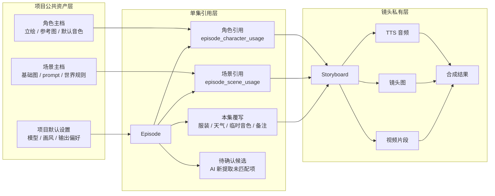
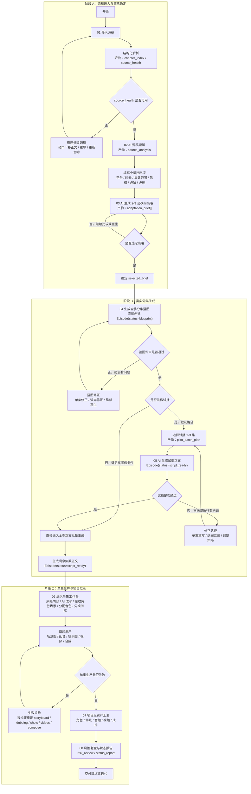

# 短剧项目 AI First 重构方案

版本归属：`0.23.1`
方案版本：`v0`
日期：`2026-07-06`
范围：`/drama/[id]` 项目详情页与进入单集工作台之前的前置流程

## 1. 目标

把当前“小说源稿 -> 方案草稿 -> 分集制作”的伪规划链路，重构为一条真实的、可追溯的、由 AI 逐步产出中间成果的改编生产链。

核心判断：

- 用户不需要一个“看起来完整但实际是规则模板”的方案草稿。
- 用户需要的是“每一步都真的生成了什么”。
- `Episode` 应该尽早成为主对象，而不是最后才被批量创建。
- 单集工作台已经接近真实 AI 生产链，前半段应该为它提供真实输入，而不是占位文本。

## 2. 设计定位

### 四个定位问题

- 叙事角色：这是一个`AI 生产工作台`，不是展示页，也不是纯表单页。
- 观看距离：以桌面端为主，支持运营、策划、导演式长时间停留与决策。
- 视觉温度：`冷静、可靠、生产导向`，弱化“魔法感”，强化“产物感”。
- 容量判断：单页要同时容纳流程状态、AI 产物、批量操作、异常处理，因此要采用`多区块分层`而不是单块大面板堆叠。

### 设计系统决策

- Anchor：`application`
- 色彩：中性色为主，单一强调色只用于当前步骤与主 CTA
- 字体：中文正文偏系统无衬线，状态/标签可用等宽字强化“流程感”
- 间距：`8px` 基线
- 圆角：中圆角，避免过度卡片化
- 阴影：仅用轻阴影区分层级，不用“漂浮感”包装 AI
- 动效：150ms 到 220ms，强调状态切换和抽屉展开，不做装饰性动画

## 3. 当前方案的问题

### 3.1 产品逻辑问题

- `方案草稿`不是 AI 真实产物，而是规则模板。
- 角色圣经、场景圣经、分集大纲被包装成了“已规划完成”，但可信度不足。
- 用户修改参数后，草稿会自动被重算，导致“草稿”既像正式产物，又像实时预览，概念不清。
- “配置默认值”混在改编流程里，打断主任务。

### 3.2 交互问题

- 前半段把“参数设置”“草稿评审”“生成分集”塞在一块，职责不清。
- 用户看不到 AI 到底在哪一步真正工作了。
- 缺少“先试播再全量”的自然路径。
- 当前 UI 的主列表对象是“草稿 outline”，不是“真实 episode”。

### 3.3 数据问题

- `adaptationPlan` 抢占了核心位置，但它并不是最终可生产对象。
- `Episode` 创建过晚，导致无法围绕单集做渐进式生成、失败恢复和批量调度。
- 角色与场景圣经被当作前置硬门槛，实际上更适合作为派生结果和持续补全结果。

## 4. 新北极星

一句话：

> 先让 AI 生成真实的分集对象，再围绕这些真实对象继续改编、分镜、出图、配音和成片。

## 5. 新流程

## 5.1 Step 1：源稿导入

用户提供小说全文、章节文件或已有小说项目。

系统立即做两件事：

- 结构化解析：章节、字数、人物命名密度、叙事连续性、异常段落
- AI 理解：主题、核心冲突、主角目标、世界规则、情绪强度、改编风险

产物：

- `source_analysis`
- `source_health`

用户价值：

- 先知道这份源稿“适不适合直接改”
- 不再是导入后立刻进入一个空草稿界面

## 5.2 Step 2：AI 改编策略

用户输入少量控制项：

- 目标平台
- 目标时长
- 目标集数范围
- 风格方向
- 必须保留
- 必须删除

AI 输出 2 到 3 套可选策略：

- 强钩子短剧版
- 情绪拉扯版
- 高反转版

每套策略必须包含：

- 改编主张
- 节奏模型
- 集数建议
- 风险提示
- 适合的风格与产能成本

产物：

- `adaptation_brief[]`
- 用户最终选择一个 `selected_brief`

用户价值：

- 不再让用户一开始就拍脑袋选固定参数
- 让 AI 先提出可比较的方向

## 5.3 Step 3：生成真实分集蓝图

AI 基于 `selected_brief` 直接创建真实 `Episode`，状态为 `blueprint`。

每个 episode 至少有：

- 标题
- 集定位
- 开场钩子
- 本集摘要
- 原文映射范围
- 出场角色
- 核心场景
- 结尾悬念
- 风险提示

产物：

- `episode.status = blueprint`
- `episode.blueprint_payload`

用户价值：

- 看到的已经是真实分集，不是假大纲
- 可以逐集评审、逐集修正、逐集重生

## 5.4 Step 4：AI 生成分集正文

提供两种批量策略：

- `先生成试播 1-3 集`
- `全季批量生成`

AI 为选中的 episode 生成真实正文，状态进入 `script_ready`。

正文生成后，用户可以：

- 通过
- 单集重写
- 退回蓝图
- 修改蓝图后重生

产物：

- `episode.content`
- `episode.script_content`
- `episode.status = script_ready`

用户价值：

- 高成本步骤可以先小样验证
- 全量生产不再是黑盒

## 5.5 Step 5：进入单集工作台

沿用现有能力链：

- 原始内容
- AI 改写
- 提取角色场景
- 分配音色
- 分镜拆解
- 场景图
- 配音
- 镜头图
- 视频
- 合成

这里不再需要一个额外的“假计划层”。

单集工作台的正确逻辑不是“本集从零再造一套角色、配音、场景图”，而是：

- 优先引用项目公共资产
- 必要时只对本集做局部覆写
- 把镜头产物严格留在 storyboard 私有层

### 5.5.1 三层资产模型

第一层：项目公共主档

- 角色主档：主角/配角基础设定、立绘、参考图、默认音色
- 场景主档：核心地点、基础场景图、统一 prompt、世界观约束
- 风格主档：默认模型、默认画风、默认视频与配音策略

第二层：单集引用与覆写

- 本集用了哪些角色
- 本集用了哪些场景
- 本集对角色做了什么临时变化
- 本集对场景做了什么局部变化
- 本集是否临时改音色、服装、伤势、天气、昼夜、陈设

第三层：镜头私有产物

- 分镜文本
- TTS 音频
- 镜头图
- 视频片段
- 合成结果

原则：

- “音色配置”是公共资产
- “配音音频文件”是镜头私有产物
- “场景主图”是公共资产
- “某个镜头里为了这次构图生成的图”是镜头私有产物

### 5.5.2 进入工作台时的默认装配逻辑

1. 先读取 `episode.blueprint + episode.script_content`
2. AI 提取本集候选角色、候选场景、候选镜头
3. 系统优先把候选项与项目公共主档做匹配，而不是直接新建
4. 匹配成功后，仅建立“本集引用关系”
5. 匹配失败的项进入“待确认候选区”
6. 用户对候选项做三选一：
   - 合并到已有公共主档
   - 新建为项目公共主档
   - 只作为本集临时对象
7. 只有引用关系稳定后，才进入配音、场景图、镜头图、视频生产

这会把“提取”从一次性写库动作，改成“提取 -> 匹配 -> 确认 -> 生产”的更科学链路。

### 5.5.3 哪些应该继承公共资产

应该默认继承公共资产的对象：

- 主角与常驻角色
- 角色默认音色
- 角色主立绘与参考图包
- 常驻核心场景
- 场景基础图
- 统一画风与模型默认值

只应在单集层覆写的对象：

- 角色服装
- 角色伤势、年龄阶段、情绪状态
- 临时伪装、回忆滤镜、旁白音色
- 场景天气、昼夜、破损状态、陈设变化
- 本集临时新增但不值得升格为公共主档的路人角色或一次性地点

只应留在镜头私有层的对象：

- 分镜上的角色站位
- 某句台词的配音音频
- 某镜头的首尾帧图
- 某镜头的视频与合成片段

### 5.5.4 工作台里的关键交互规则

- 任何编辑都必须先声明作用域：`更新项目主档` / `仅本集生效` / `仅本镜头生效`
- 当用户修改主角主图、默认音色、核心场景基底图时，禁止静默覆盖公共资产
- 如果公共主档被更新，所有引用它的集数应显示“可同步 / 保持旧版本”
- 如果本集引用的是公共资产，但当前镜头需要特殊表现，应优先生成镜头级产物，而不是复制一份新角色/新场景
- 如果 AI 新提取出“疑似同一角色/同一地点”的候选，默认进入“待合并”而不是直接新增

### 5.5.5 单集工作台资产关系图

### 5.5.6 单集工作台页面改造点

单集工作台不再新增独立原型页，直接改现有页面：

- 顶栏增加资产继承状态：继承角色数、继承场景数、本集覆写数、缺失资产数
- 剧本阶段把“提取角色场景”改为“提取并匹配资产”
- 提取结果区增加候选确认：合并到公共主档、新建公共主档、仅本集使用
- 音色阶段显示来源：项目默认音色、本集临时音色、缺失音色
- 制作阶段生成角色图和场景图时，默认读取公共主档引用
- 镜头详情区增加作用域选择：更新项目主档、仅本集生效、仅本镜头生效
- 导出阶段展示依赖完整性：未确认候选、缺失图片、缺失音频、失败镜头

## 5.6 Step 6：成片与资产闭环

项目页聚合：

- 每集状态
- 每集成片
- 角色图
- 场景图
- 音频
- 合成结果
- 失败任务与重跑入口

## 5.7 详细流程图

补充说明：

- 默认主路径是：`源稿理解 -> 策略选择 -> 全季蓝图 -> 试播 1-3 集 -> 通过后生成剩余正文 -> 单集工作台生产`。
- 关键回路有三条：`源稿修复回路`、`蓝图修正回路`、`试播失败回路`，它们都优先局部修正，而不是整季推翻。
- `配置默认值`、模型选择、项目运行偏好不属于主叙事流程，应放在 `设置` 页面，而不是插进这条主流程里。

## 6. 信息架构

项目页一级导航建议改为：

1. `概览`
2. `源稿理解`
3. `改编策略`
4. `分集`
5. `资产`
6. `设置`

其中：

- `设置` 单独放图片、视频、配音模型默认值
- `分集` 成为最高频入口
- `源稿理解` 和 `改编策略` 是可复查的历史产物，而不是一次性步骤

## 7. 页面改造清单

本方案不再维护独立原型文件，直接描述现有页面如何改。

### 7.1 `/drama` 短剧项目列表

对应文件：`apps/web/src/app/(default)/(protected)/drama/page.tsx`

保留：

- 项目搜索、排序、筛选
- 新建项目弹窗
- 项目卡片入口
- 删除项目能力

要加：

- 项目阶段徽标：`待导入源稿`、`待选择策略`、`蓝图已生成`、`试播生成中`、`制作中`、`可导出`
- 下一步主动作：导入源稿、生成源稿理解、选择策略、生成分集蓝图、继续制作
- 风险提示：源稿异常、AI 配置缺失、失败任务数
- 进度摘要：蓝图集数、正文已生成集数、制作完成集数

要改：

- 项目卡片从“集数/角色数”改为“当前阶段 + 下一步”
- 点击项目仍进入 `/drama/[id]`，但默认落到概览页

要减：

- 不在列表页暴露“方案草稿”概念
- 不把项目是否可制作仅等同于“已有集数”

### 7.2 `/drama/[id]` 项目详情概览

对应文件：`apps/web/src/app/(default)/drama/[id]/page.tsx`

定位：项目驾驶舱，只回答“项目现在在哪里、下一步做什么、哪里有风险”。

保留：

- 项目头图、标题、风格、集数等基础信息
- 进入单集工作台入口
- 查看源稿入口

要加：

- 全链路阶段条：源稿 -> 源稿理解 -> 改编策略 -> 分集蓝图 -> 试播正文 -> 单集制作 -> 导出
- 当前阻塞项：缺源稿、源稿异常、未选策略、蓝图未确认、AI 配置缺失、任务失败
- 下一步主按钮，只出现一个最推荐动作
- 最近生成记录：上次 AI 生成了什么、是否可回滚、是否可重跑
- 项目资产摘要：公共角色数、公共场景数、待确认候选数、缺失素材数

要改：

- 当前“创作中枢”三步条改成真实状态机
- 当前 `tabs` 的 `episodes / characters / scenes / source / plan` 改为项目子导航
- 分集卡只展示真实 episode，不展示规则模板 outline

要减：

- 删除“02 方案草稿”主面板
- 删除“方案草稿已生成”这类伪完成状态
- 删除“确认生成分集”这种从假大纲批量创建分集的入口
- 删除主流程里的“配置默认值”，移动到项目设置

### 7.3 新增 `/drama/[id]/source` 源稿理解页

建议新增文件：`apps/web/src/app/(default)/drama/[id]/source/page.tsx`

定位：源稿输入、源稿健康检查、AI 源稿理解。

要加：

- 源稿导入区：粘贴全文、从小说作品导入、重新导入
- 源稿健康检查：字数、章节数、异常段落、重复内容、疑似目录
- AI 源稿理解结果：核心冲突、主角、对手、关系网络、世界规则、可改编风险
- 证据回溯：每条理解结论可查看来自哪些章节或段落
- 重跑入口：仅重跑健康检查、仅重跑源稿理解

要改：

- 当前项目详情页里的源稿弹窗和源稿 tab 迁移到该页

要减：

- 不在源稿页出现分集制作按钮
- 不在源稿页要求用户配置图片、视频、配音模型

### 7.4 新增 `/drama/[id]/strategy` 改编策略页

建议新增文件：`apps/web/src/app/(default)/drama/[id]/strategy/page.tsx`

定位：AI 给出 2 到 3 套真实改编路线，用户选择一套作为后续蓝图输入。

要加：

- 策略卡：节奏、受众、爆点密度、保留程度、制作成本、风险
- 策略对比：差异点、适合场景、预计集数、生成成本
- 策略编辑：目标集数、单集时长、视觉风格、必留内容、禁改内容
- 选择策略后生成 `selected_brief`
- 重新生成策略入口

要改：

- 当前“改编目标”只作为策略输入，不再直接拼成方案草稿

要减：

- 删除规则模板式的“目标：24 集、围绕核心冲突”等占位文案

### 7.5 新增 `/drama/[id]/episodes` 分集生产页

建议新增文件：`apps/web/src/app/(default)/drama/[id]/episodes/page.tsx`

定位：分集蓝图、分集正文和批量调度的主页面。

要加：

- 批量动作：生成全季蓝图、生成试播 1 到 3 集、生成剩余正文、只重跑失败集
- Episode 列表：每集状态、蓝图摘要、正文状态、制作状态、失败原因
- 右侧详情：本集蓝图、本集正文、源稿追溯、AI 生成历史
- 局部修正：重写单集蓝图、重写单集正文、退回策略、退回源稿理解
- 进入单集工作台按钮

要改：

- 当前项目详情页的分集 tab 迁移到该页
- 分集从 outline 预览改为真实 `Episode` 主对象

要减：

- 不允许点击一行分集就隐式创建整季分集
- 不展示无法进入生产的“假分集行”

### 7.6 `/drama/[id]/episode/[episodeNumber]` 单集工作台

对应文件：

- `apps/web/src/app/(studio)/drama/[id]/episode/[episodeNumber]/page.tsx`
- `apps/web/src/components/episode/script/script-panel.tsx`
- `apps/web/src/components/episode/production/production-panel.tsx`
- `apps/web/src/components/episode/export/export-panel.tsx`
- `apps/web/src/hooks/use-workbench.ts`

保留：

- `剧本 / 制作 / 导出` 三段式工作台
- AI 改写、分镜拆解、配音、镜头图、视频、合成能力
- studio 独立壳，不并入 default 顶栏

要加：

- 资产引用栏：公共角色、公共场景、待确认候选、缺失项
- 提取后匹配确认：合并到公共主档、新建公共主档、仅本集使用
- 作用域选择：更新项目主档、仅本集生效、仅本镜头生效
- 公共资产同步提示：公共主档已更新时，本集可选择同步或保持旧版本
- 镜头依赖检查：缺角色图、缺场景图、缺音频、缺视频时给出明确阻塞

要改：

- “提取角色场景”改成“提取并匹配资产”
- 角色图、默认音色、场景图默认从项目公共主档读取
- 场景图生成区区分“公共场景基底图”和“本集局部场景图”
- 导出页从只看合成完成数，改为同时看资产依赖完整性

要减：

- 不在单集里重复创建主角和常驻场景
- 不把每次镜头图生成结果回写成公共场景图
- 不静默覆盖公共角色音色和公共场景图

### 7.7 新增 `/drama/[id]/assets` 项目资产页

建议新增文件：`apps/web/src/app/(default)/drama/[id]/assets/page.tsx`

定位：项目级角色、场景、音色、镜头产物的统一管理页。

要加：

- 角色主档：立绘、参考图、默认音色、出现集数
- 场景主档：基础图、prompt、世界规则、出现集数
- 音色主档：角色默认音色、试听文件、缺失音色
- 单集覆写视图：本集服装、天气、伤势、临时音色
- 镜头产物视图：TTS、镜头图、视频片段、合成片段
- 合并候选：疑似同一角色、疑似同一场景

要改：

- 当前项目详情页里的角色 tab、场景 tab 迁移到该页

要减：

- 不把角色、场景、镜头媒体混在一个平铺列表里
- 不把一次性路人和主角放在同一优先级

### 7.8 新增 `/drama/[id]/settings` 项目设置页

建议新增文件：`apps/web/src/app/(default)/drama/[id]/settings/page.tsx`

定位：只放影响生产默认值、但不属于主叙事流程的配置。

要加：

- 默认图片模型
- 默认视频模型
- 默认配音模型
- 默认画风
- 默认单集时长
- 发布平台偏好
- 主角默认音色
- 项目级提示词约束

要改：

- 当前项目详情页的“配置默认值”抽到该页
- 全局设置仍在 `/settings`，项目设置只保存当前项目覆盖项

要减：

- 不在主流程页面穿插模型配置
- 不让用户在确认策略前被迫配置所有生产模型

### 7.9 `/assets` 全局素材页

对应文件：`apps/web/src/app/(default)/(protected)/assets/page.tsx`

保留：

- 跨项目素材检索
- 角色、场景、媒体聚合
- 打开来源项目

要加：

- 素材作用域筛选：公共主档、单集覆写、镜头产物
- 来源链路：项目、集数、镜头、生成任务
- 复用关系：被哪些项目、集、镜头引用

要改：

- 全局素材页只做跨项目检索，不承担单个项目的资产治理
- 单项目资产治理移到 `/drama/[id]/assets`

要减：

- 不在全局素材页处理本集候选合并
- 不在全局素材页做项目级默认音色配置

### 7.10 `/settings` 全局设置页

对应文件：`apps/web/src/app/(default)/(protected)/settings/page.tsx`

保留：

- AI 服务配置
- 模型供应商配置
- 音色同步和服务可用性管理

要加：

- 全局默认模型模板
- 项目继承说明：项目可覆盖全局默认值
- 配置健康检查：图片、视频、音频是否可用于短剧链路

要改：

- 全局设置只管账户级默认值和供应商能力
- 项目级默认值移到 `/drama/[id]/settings`

要减：

- 不在全局设置里管理单个项目的主角音色和发布偏好

### 7.11 不需要新增的页面

- 不新增独立原型页面
- 不新增“方案草稿”页面
- 不新增“角色圣经生成前置页”
- 不新增“场景圣经生成前置页”
- 不把单集工作台拆成多个路由页面

## 8. 关键对象与状态机

### 8.1 Drama 状态

- `source_pending`
- `source_ready`
- `brief_pending`
- `brief_selected`
- `blueprint_generating`
- `blueprint_ready`
- `script_generating`
- `in_production`
- `deliverable_ready`

### 8.2 Episode 状态

- `blueprint`
- `script_generating`
- `script_ready`
- `storyboard_ready`
- `asset_ready`
- `composed`
- `failed`

### 8.3 允许动作

- `blueprint -> regenerate_blueprint`
- `blueprint -> generate_script`
- `script_ready -> rewrite_script`
- `script_ready -> open_workbench`
- `failed -> retry_failed_step`

### 8.4 资产引用状态

- `candidate`：AI 提取出来但尚未确认
- `linked`：已引用项目公共主档
- `overridden`：已在单集层做局部覆写
- `local_only`：仅本集存在，不回写公共主档
- `outdated`：公共主档已更新，本集仍引用旧快照

## 9. 数据模型建议

### 9.1 新增

- `source_analysis`
- `adaptation_brief`
- `drama.selected_brief_id`
- `episode.blueprint_payload`
- `episode.generation_mode`
- `episode.failure_reason`
- `episode.source_trace`

### 9.2 弱化

- 当前 `adaptationPlan` 不再作为主对象

建议改成：

- 仅做兼容层
- 或迁移为 `brief + episode blueprints` 的组合

### 9.3 派生视图

- 角色圣经：由已生成蓝图和正文汇总
- 场景圣经：由蓝图、分镜和场景图汇总

不再要求一开始就“先完整生成”

### 9.4 共享资产与覆写模型

推荐把现有数据结构明确成三层语义：

- `characters`：继续作为项目级角色主档
- `episode_characters`：继续作为“本集引用角色”的关系表
- `scenes`：明确区分公共场景与单集场景，不再语义混用
- `episode_scenes`：继续作为“本集引用场景”的关系表
- `storyboards`：继续承载镜头私有产物

建议新增或补强的字段：

- `episode_characters.override_payload`
- `episode_characters.link_source`
- `scenes.scope = drama | episode`
- `scenes.master_scene_id`
- `episode_scenes.override_payload`
- `storyboards.render_snapshot`

含义：

- `override_payload`：记录本集覆写字段，不复制整份主档
- `link_source`：标记是 AI 匹配、人工合并还是人工新建
- `scenes.scope`：避免现在 `drama_id + episode_id + episode_scenes` 三套语义混用
- `master_scene_id`：允许“公共场景 -> 本集变体场景”的继承关系
- `render_snapshot`：记录该镜头生成时使用了哪个角色图、哪个场景图、哪个音色版本，保证可追溯

### 9.5 最小兼容落地法

即使不立刻大改库表，也可以先按下面约定收敛行为：

- `characters` 全部视为项目公共主档
- `episode_characters` 只负责建立引用，不复制角色
- `scenes.episode_id = null` 先约定为公共场景
- `scenes.episode_id != null` 先约定为单集局部场景
- 工作台新增“作用域选择”与“候选合并”交互，先把行为做对
- 等行为稳定后，再补 `scope / override_payload / render_snapshot`

## 10. 批量策略

### 10.1 推荐默认

默认不做“整季一键全生成”，而是：

- 第一优先：生成 1 到 3 集试播正文
- 用户确认方向后：继续生成剩余集数

### 10.2 批量入口

- `生成试播 3 集`
- `生成前 10 集`
- `生成全部蓝图`
- `生成全部正文`

### 10.3 批量控制

- 允许暂停
- 允许取消后续未开始任务
- 允许失败后只重跑失败集

## 11. AI 责任边界

### 必须由 AI 负责

- 源稿理解
- 改编策略生成
- 分集蓝图生成
- 分集正文生成
- 单集改写
- 角色/场景提取
- 分镜拆解

### 不应伪装成 AI 的部分

- 纯参数保存
- 项目默认模型设置
- 仅基于固定模板拼接的占位文本

## 12. 迁移建议

### Phase 1：最小可落地

- 保留单集工作台不动
- 新增 `source_analysis` 与 `adaptation_brief`
- 把当前 `adaptationPlan` 改造成 `Episode blueprint` 列表
- 分集页直接围绕 episode 工作

### Phase 1.5：工作台共享资产化

- 保留现有生产链
- 把角色、音色、场景图明确拆成“公共主档 / 单集覆写 / 镜头私有”
- 提取后优先做公共资产匹配，而不是直接新增对象
- 增加“更新项目主档 or 仅本集生效”的作用域交互
- 给单集工作台补上候选合并、缺失提示、同步更新入口

### Phase 2：替换旧方案草稿

- 删除当前“02 方案草稿”主面板
- 拆成 `源稿理解 / 改编策略 / 分集`
- `配置默认值` 移到设置

### Phase 3：全链路可追溯

- 加入任务日志
- 加入每集生成历史
- 加入每次重写的版本记录

## 13. 成功指标

- 用户从导入源稿到生成第一集正文的完成率
- 用户在试播 3 集后继续生成全季的比例
- 单集重生率与全季推翻率
- 源稿理解后的退出率
- 分集蓝图被人工修改的比例
- 失败重跑成功率

## 14. 页面增减结论

删除：

- 独立 HTML 原型文件
- 当前产品里的“方案草稿”主流程概念
- 项目详情页里的“配置默认值”主按钮
- 假分集 outline 预览和隐式创建分集行为

修改：

- `/drama`：从项目卡片列表升级为带生产阶段和下一步动作的项目列表
- `/drama/[id]`：从混合工作区升级为项目概览驾驶舱
- `/drama/[id]/episode/[episodeNumber]`：从单集独立生产升级为公共资产引用型工作台
- `/assets`：从平铺素材库升级为跨项目检索页
- `/settings`：从单纯供应商配置升级为全局默认与服务健康页

新增：

- `/drama/[id]/source`
- `/drama/[id]/strategy`
- `/drama/[id]/episodes`
- `/drama/[id]/assets`
- `/drama/[id]/settings`

不新增：

- 独立原型页
- 方案草稿页
- 独立角色圣经页
- 独立场景圣经页
